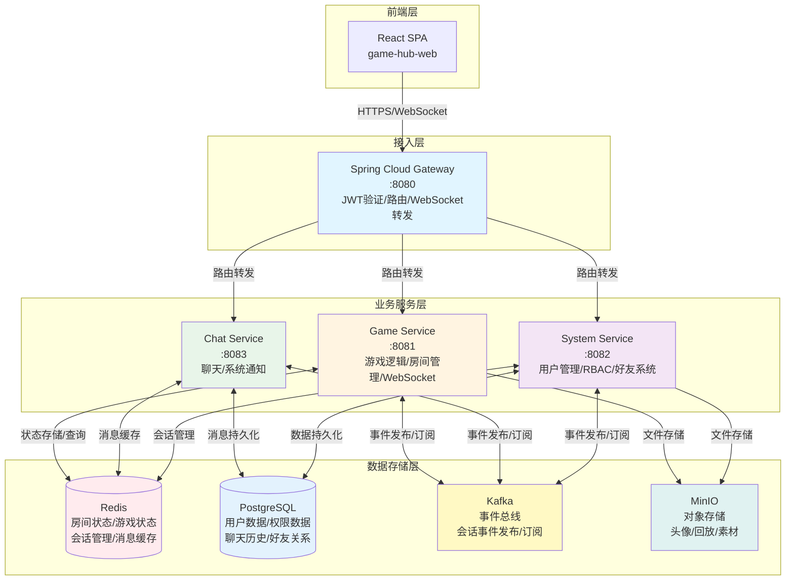

# 🎮 Game Hub - 实时对战游戏平台

> 基于 Java 微服务架构的生产级实时对战游戏平台，具备 WebSocket 实时通信、会话治理、房间状态管理和跨服务协作能力。

[](https://www.oracle.com/java/) [](https://spring.io/projects/spring-boot) [](https://spring.io/projects/spring-cloud) [](LICENSE)

---

## 🏛️ 系统架构

*整体微服务架构与实时通信关系图*

系统采用微服务架构，通过 Spring Cloud Gateway 作为统一入口，实现 JWT 统一鉴权、路由转发和 WebSocket 连接管理。核心服务包括游戏服务、聊天服务和用户服务，通过 Kafka 事件总线实现服务间解耦通信，使用 Redis 管理房间状态和会话信息，PostgreSQL 持久化业务数据。

### 架构图



**架构特点**：
- **统一网关**：Gateway 层统一处理认证、路由和 WebSocket 转发
- **服务解耦**：通过 Kafka 事件总线实现异步通信，降低服务间耦合
- **状态管理**：Redis 存储房间和游戏状态，支持快速查询和恢复
- **实时通信**：双 WebSocket 连接架构，游戏和聊天功能独立管理

### 架构组件说明

| 服务 | 端口 | 职责 |
|------|------|------|
| **gateway** | 8080 | API 网关，统一入口，JWT 验证，路由转发，WebSocket 转发 |
| **game-service** | 8081 | 游戏服务，五子棋逻辑，房间管理，WebSocket 实时对局 |
| **system-service** | 8082 | 用户服务，用户管理，RBAC 权限，好友系统 |
| **chat-service** | 8083 | 聊天服务，大厅/房间/私聊，系统通知推送 |

### 数据存储

- **PostgreSQL**：用户数据、权限数据、聊天历史、好友关系
- **Redis**：房间状态、游戏状态、会话管理、倒计时状态、消息缓存
- **Kafka**：会话事件发布/订阅，跨服务事件驱动
- **MinIO**：头像、游戏回放、活动素材文件存储

---

## 🎯 产品概览

Game Hub 是一个实时对战游戏平台，提供首页导航、匹配大厅、实时对战和社交聊天等核心功能。平台支持多人在线游戏，通过 WebSocket 实现低延迟的实时通信，具备完整的会话治理和状态恢复能力。

### 产品功能预览

#### 首页


*首页界面 - Hero 轮播图、游戏分类展示、进行中游戏提示*

首页提供欢迎轮播图、游戏分类展示（热门游戏、新游戏、策略/棋牌）和进行中游戏提示。用户可以通过游戏卡片快速进入匹配大厅开始游戏，或继续之前未完成的对局。

#### 匹配大厅


*匹配大厅界面 - 房间列表、快速匹配、选择模式*

匹配大厅提供房间列表、快速匹配和模式选择等功能。玩家可以创建房间、加入房间或通过匹配系统快速开始游戏。

#### 实时对战


*实时对战界面 - PVP/PVE 模式、实时棋盘同步、倒计时系统*

支持 PVP 和 PVE 模式，基于 WebSocket 实现实时棋盘状态同步，包含倒计时系统、AI 引擎和游戏状态持久化。

#### 个人中心


*个人中心界面 - 用户信息、战绩统计、设置管理*

个人中心提供用户信息管理、头像上传、战绩统计和设置功能。用户可以查看游戏数据、胜率统计、对局历史，管理个人资料和偏好设置。

#### 好友系统


*好友系统界面 - 好友列表、添加好友、好友申请管理*

提供完整的好友系统功能，支持搜索用户、发送好友申请、同意/拒绝申请、查看好友列表和好友状态。支持在线状态显示和好友分组管理。

#### 系统通知


*系统通知界面 - 实时推送、通知分类、已读未读管理*

系统通知通过 WebSocket 实时推送，包括好友申请、游戏邀请、系统公告等。支持通知分类、已读未读状态管理和批量操作。

#### 好友聊天


*好友聊天界面 - 私聊消息、消息历史、已读回执*

提供点对点私聊功能，支持实时消息收发、消息历史加载、已读未读状态显示和未读消息计数。消息持久化存储，支持跨设备同步。

#### 社交聊天


*社交聊天界面 - 大厅/房间/私聊、消息持久化、系统通知*

提供大厅聊天、房间聊天和私聊功能，支持消息持久化、已读未读状态和系统通知推送。

---

## 📋 目录

- [系统架构](#-系统架构)
- [产品概览](#-产品概览)
- [系统能力](#-系统能力)
- [技术栈](#-技术栈)
- [项目简介](#-项目简介)
- [项目结构](#-项目结构)
- [快速开始](#-快速开始)
- [服务说明](#-服务说明)
- [开发指南](#-开发指南)
- [部署说明](#-部署说明)
- [文档](#-文档)
- [贡献指南](#-贡献指南)
- [许可证](#-许可证)

---

## 🔧 系统能力

### WebSocket 实时通信

系统采用双 WebSocket 连接架构，游戏逻辑和聊天功能独立管理，降低耦合度。基于 STOMP 协议实现消息路由，支持点对点和广播通信。Gateway 层统一管理 WebSocket 连接，实现 Token 透传和连接状态监控。

- **双连接架构**：游戏 WebSocket 和聊天 WebSocket 独立管理
- **STOMP 协议**：标准化消息格式，支持订阅/发布模式
- **连接管理**：Gateway 层统一管理连接生命周期
- **消息路由**：支持点对点、房间广播、系统广播

### 会话治理

实现单设备登录机制，支持会话注册、WebSocket 会话映射和多端互踢功能。通过 Kafka 事件总线实现跨服务会话状态同步，Gateway 维护 Token 黑名单，支持 Token 撤销和登出时自动加入黑名单。

- **单设备登录**：同一用户仅允许一个活跃会话
- **会话映射**：HTTP 会话与 WebSocket 会话关联管理
- **多端互踢**：新设备登录自动踢出旧设备
- **Token 黑名单**：支持 Token 撤销，登出时自动加入黑名单

### 房间状态与对局重入

系统实现完整的对局状态持久化与恢复机制，确保客户端断线重连和服务端重启后均能完整恢复对局状态。

**状态持久化**：
- 房间状态和游戏状态存储在 Redis，包含完整的棋盘信息、玩家信息、回合状态和倒计时状态
- 游戏状态变更实时同步到 Redis，确保数据一致性
- 支持状态快照和增量更新两种模式

**客户端重入恢复**：
- 前端用户离开对局后重新进入，系统自动从 Redis 恢复完整的对局状态
- 客户端重连后通过 WebSocket 订阅房间状态，服务端推送当前对局快照
- 支持断线期间的落子历史回放，确保用户感知连续性

**服务端重入恢复**：
- 后端服务重启后，从 Redis 恢复所有活跃房间的游戏状态
- 服务启动时自动加载房间列表和对应游戏状态，重建内存中的游戏实例
- 通过事件机制通知其他服务房间状态已恢复，确保跨服务状态一致性

**技术实现**：
- 基于 Redis 的分布式状态存储，支持高可用和持久化
- 状态变更通过 Kafka 事件总线实现跨服务通知
- 倒计时系统基于 Redis 的分布式锁和过期机制

### 跨服务协作

通过 Spring Cloud Gateway 实现统一入口和路由转发，服务间通过 OpenFeign 进行同步调用，通过 Kafka 进行异步事件通信。Gateway 负责 JWT 验证和 Token 刷新，各业务服务专注于业务逻辑实现。

- **Gateway 统一入口**：JWT 验证、路由转发、跨域配置
- **服务间调用**：OpenFeign 同步调用，Kafka 异步事件
- **事件驱动**：Kafka 事件总线实现服务解耦
- **统一鉴权**：Gateway 层统一处理认证授权

---

## 🛠️ 技术栈

### 后端技术

| 技术 | 版本 | 说明 |
|------|------|------|
| **Java** | 21 | 编程语言 |
| **Spring Boot** | 3.3.13 | 应用框架 |
| **Spring Cloud** | 2023.0.6 | 微服务框架 |
| **Spring Security** | - | 安全框架 |
| **Keycloak** | 25.0.1 | 身份认证服务 |
| **PostgreSQL** | 17.6 | 关系型数据库 |
| **Redis** | 7-alpine | 缓存/状态存储 |
| **Kafka** | - | 消息队列 |
| **MinIO** | - | 对象存储 |
| **Maven** | - | 构建工具 |

### 前端技术

| 技术 | 版本 | 说明 |
|------|------|------|
| **React** | 19.2.0 | UI 框架 |
| **Vite** | 7.2.4 | 构建工具 |
| **React Router** | 7.9.6 | 路由管理 |
| **SockJS** | 1.6.1 | WebSocket 传输层 |
| **STOMP.js** | 7.2.1 | STOMP 协议客户端 |

### 基础设施

- **Docker** & **Docker Compose**：容器化部署
- **Spring Cloud Gateway**：API 网关
- **OpenFeign**：服务间调用
- **Spring WebSocket**：实时通信

---

## 🎯 项目简介

**Game Hub** 是一个基于微服务架构的实时对战游戏平台，旨在提供一站式的匹配大厅、实时对战、聊天室、个人成长体系等功能。平台采用云原生设计，支持统一身份鉴权、实时通信、多游戏接入。

### 产品定位

- **玩家**：一站式大厅、匹配、聊天室、个人成长体系、跨端无缝体验，能在多种小游戏间自由切换
- **运营**：精细化用户管理、权限配置、在线会话监控、活动与内容投放，支持多游戏联动运营
- **技术**：云原生微服务、统一身份鉴权、可观测性、快速接入"任意类型小游戏引擎"

### 当前状态

✅ **已完成**：
- 五子棋游戏（PVP/PVE 模式）
- 用户认证与授权（Keycloak OAuth2/OIDC）
- 实时通信（WebSocket + STOMP）
- 社交功能（好友系统、私聊、房间聊天）
- 会话管理（单设备登录、踢线功能）

🚧 **规划中**：
- 匹配服务
- 战绩持久化与复盘
- 后台管理界面
- 可观测性（Prometheus/Grafana）
- Kubernetes 部署

---

## 📁 项目结构

```
game-hub-parent/
├── apps/                          # 应用模块
│   ├── gateway/                   # API 网关服务
│   │   ├── src/main/java/        # 网关核心代码
│   │   └── AUTH_GUIDE.md         # 认证指南
│   ├── game-service/              # 游戏服务
│   │   ├── src/main/java/        # 游戏核心代码
│   │   │   └── games/gomoku/     # 五子棋游戏实现
│   │   └── src/main/resources/   # 配置文件
│   ├── system-service/            # 用户服务
│   │   ├── src/main/java/        # 用户管理代码
│   │   └── src/main/resources/   # 配置文件
│   └── chat-service/              # 聊天服务
│       ├── src/main/java/        # 聊天核心代码
│       └── src/main/resources/   # 配置文件
├── libs/                          # 公共库
│   ├── session-common/            # 会话管理公共库
│   └── session-kafka-notifier/    # 会话事件通知库
├── docs/                          # 项目文档
│   ├── 项目总体蓝图与架构层级图.md
│   ├── 完整数据库设计-V1.0.md
│   ├── game-service/              # 游戏服务文档
│   ├── chat-service/              # 聊天服务文档
│   ├── system-service/            # 用户服务文档
│   └── Keycloak配置指南.md
├── docker-compose.yml             # Docker Compose 配置
├── pom.xml                        # Maven 父 POM
└── README.md                      # 项目说明文档
```

---

## 🚀 快速开始

### 前置要求

- **Java** 21+
- **Maven** 3.8+
- **Docker** & **Docker Compose**
- **Git**

### 1. 克隆项目

```bash
git clone https://github.com/your-username/game-hub-parent.git
cd game-hub-parent
```

### 2. 启动基础设施

使用 Docker Compose 启动 PostgreSQL、Redis、Kafka、Keycloak、MinIO：

```bash
docker-compose up -d postgres redis kafka keycloak minio
```

等待所有服务启动完成（约 1-2 分钟）。

### 3. 配置 Keycloak

1. 访问 Keycloak 管理控制台：http://localhost:8180
2. 使用管理员账号登录：`admin` / `admin`
3. 创建 Realm：`gamehub`
4. 创建 Client：`gamehub-client`
5. 配置用户和角色

详细配置请参考：[Keycloak配置指南.md](docs/Keycloak配置指南.md)

### 4. 初始化数据库

执行数据库初始化脚本（如果需要）：

```bash
# 连接 PostgreSQL
docker exec -it pgsql psql -U postgres -d mydb

# 执行初始化脚本（参考 docs/完整数据库设计-V1.0.md）
```

### 5. 编译项目

```bash
mvn clean install -DskipTests
```

### 6. 启动服务

#### 方式一：使用 Docker Compose（推荐）

```bash
# 启动所有服务（包括基础设施和应用服务）
docker-compose up -d
```

#### 方式二：本地启动

```bash
# 启动 Gateway
cd apps/gateway
mvn spring-boot:run

# 启动 Game Service（新终端）
cd apps/game-service
mvn spring-boot:run

# 启动 System Service（新终端）
cd apps/system-service
mvn spring-boot:run

# 启动 Chat Service（新终端）
cd apps/chat-service
mvn spring-boot:run
```

### 7. 验证服务

- **Gateway**：http://localhost:8080
- **Keycloak**：http://localhost:8180
- **pgAdmin**：http://localhost:5050
- **MinIO Console**：http://localhost:9001

### 8. 启动前端

前端项目位于独立的仓库 `game-hub-web`，请参考前端项目的 README 启动。

---

## 🔧 服务说明

### Gateway（API 网关）

**端口**：8080

**功能**：
- JWT 验证和 Token 刷新
- 路由转发到后端服务
- WebSocket 连接转发
- 跨域配置
- Token 黑名单管理
- 会话管理和踢线功能

**配置**：`apps/gateway/src/main/resources/application.yml`

### Game Service（游戏服务）

**端口**：8081

**功能**：
- 五子棋游戏逻辑（PVP/PVE）
- 房间管理（创建、加入、离开）
- WebSocket 实时对局通信
- 倒计时系统
- AI 引擎
- 游戏状态管理

**API 文档**：参考 [game-service技术说明文档.md](docs/game-service/game-service技术说明文档.md)

### System Service（用户服务）

**端口**：8082

**功能**：
- 用户管理（CRUD）
- RBAC 权限系统
- 好友系统（申请、同意、列表）
- 通知系统
- 文件存储（头像上传）
- Keycloak 事件监听

**API 文档**：参考 [system-service技术文档.md](docs/system-service/system-service技术文档.md)

### Chat Service（聊天服务）

**端口**：8083

**功能**：
- 大厅聊天
- 房间聊天
- 私聊消息
- 系统通知推送
- 消息持久化（Redis + PostgreSQL）

**API 文档**：参考 [chat-service技术文档.md](docs/chat-service/chat-service技术文档.md)

---

## 💻 开发指南

### 开发环境配置

1. **IDE 推荐**：IntelliJ IDEA 或 Eclipse
2. **插件**：Lombok、Spring Boot DevTools
3. **代码规范**：遵循 Google Java Style Guide

### 本地开发

1. **启动基础设施**：
   ```bash
   docker-compose up -d postgres redis kafka keycloak minio
   ```

2. **配置本地环境**：
   - 修改各服务的 `application.yml`，使用本地配置
   - 确保 Keycloak 已配置完成

3. **运行服务**：
   - 使用 IDE 直接运行各服务的 `Application` 类
   - 或使用 Maven：`mvn spring-boot:run`

### 代码结构

项目采用 **DDD（领域驱动设计）** 思想，代码分层：

```
service/
├── domain/              # 领域层（实体、值对象、领域服务）
├── application/         # 应用层（用例编排）
├── infrastructure/      # 基础设施层（数据访问、外部服务）
└── interface/           # 接口层（HTTP、WebSocket）
    ├── http/            # REST API
    └── ws/              # WebSocket
```

### 添加新游戏

1. 在 `game-service/src/main/java/com/gamehub/gameservice/games/` 下创建新游戏目录
2. 实现游戏规则、AI、状态管理等模块
3. 参考 `gomoku/` 目录的实现

详细说明请参考：[项目总体蓝图与架构层级图.md](docs/项目总体蓝图与架构层级图.md)

### 测试

```bash
# 运行所有测试
mvn test

# 运行特定服务的测试
cd apps/game-service
mvn test
```

---

## 🐳 部署说明

### Docker Compose 部署

项目提供了完整的 Docker Compose 配置，支持一键启动所有服务：

```bash
# 启动所有服务
docker-compose up -d

# 查看服务状态
docker-compose ps

# 查看日志
docker-compose logs -f gateway
docker-compose logs -f game-service

# 停止所有服务
docker-compose down
```

### 生产环境部署

生产环境建议使用 **Kubernetes** 部署，当前项目已提供 K8s 配置文件（规划中）。

**注意事项**：
- 修改默认密码（PostgreSQL、Redis、Keycloak）
- 配置 HTTPS
- 设置资源限制
- 配置健康检查和自动重启
- 接入监控和日志系统

---

## 📚 文档

### 核心文档

- [项目总体蓝图与架构层级图.md](docs/项目总体蓝图与架构层级图.md) - 项目整体架构和规划
- [完整数据库设计-V1.0.md](docs/完整数据库设计-V1.0.md) - 数据库表结构设计
- [Keycloak配置指南.md](docs/Keycloak配置指南.md) - Keycloak 配置说明

### 服务文档

- [game-service技术说明文档.md](docs/game-service/game-service技术说明文档.md) - 游戏服务详细说明
- [chat-service技术文档.md](docs/chat-service/chat-service技术文档.md) - 聊天服务详细说明
- [system-service技术文档.md](docs/system-service/system-service技术文档.md) - 用户服务详细说明
- [gateway/AUTH_GUIDE.md](apps/gateway/AUTH_GUIDE.md) - 认证授权流程说明

### 其他文档

- [单设备登录系统完整实现详解.md](docs/单设备登录系统完整实现详解.md) - 单设备登录实现
- [MinIO存储结构.md](docs/MinIO存储结构.md) - 文件存储说明
- [项目风险清单与示例.md](docs/项目风险清单与示例.md) - 项目风险分析

---

## 🤝 贡献指南

欢迎贡献代码。请遵循以下步骤：

1. **Fork** 本仓库
2. 创建特性分支：`git checkout -b feature/AmazingFeature`
3. 提交更改：`git commit -m 'Add some AmazingFeature'`
4. 推送到分支：`git push origin feature/AmazingFeature`
5. 提交 **Pull Request**

### 代码规范

- 遵循 Google Java Style Guide
- 提交前运行 `mvn clean install` 确保编译通过
- 添加必要的单元测试
- 更新相关文档

### 问题反馈

如发现问题，请在 [Issues](https://github.com/your-username/game-hub-parent/issues) 中提交。

---

## 📄 许可证

本项目采用 [MIT License](LICENSE) 许可证。

---

## 👥 作者

- **lhlh1992** - *初始开发* - [GitHub](https://github.com/lhlh1992)

---

## 🙏 致谢

- [Spring Boot](https://spring.io/projects/spring-boot) - 应用框架
- [Keycloak](https://www.keycloak.org/) - 身份认证服务
- [React](https://react.dev/) - 前端框架

---

## 📞 联系方式

- **Issues**：[GitHub Issues](https://github.com/your-username/game-hub-parent/issues)
- **Email**：your-email@example.com

---

<div align="center">

**如果这个项目对你有帮助，请给一个 ⭐ Star**

Made with ❤️ by Game Hub Team

</div>
