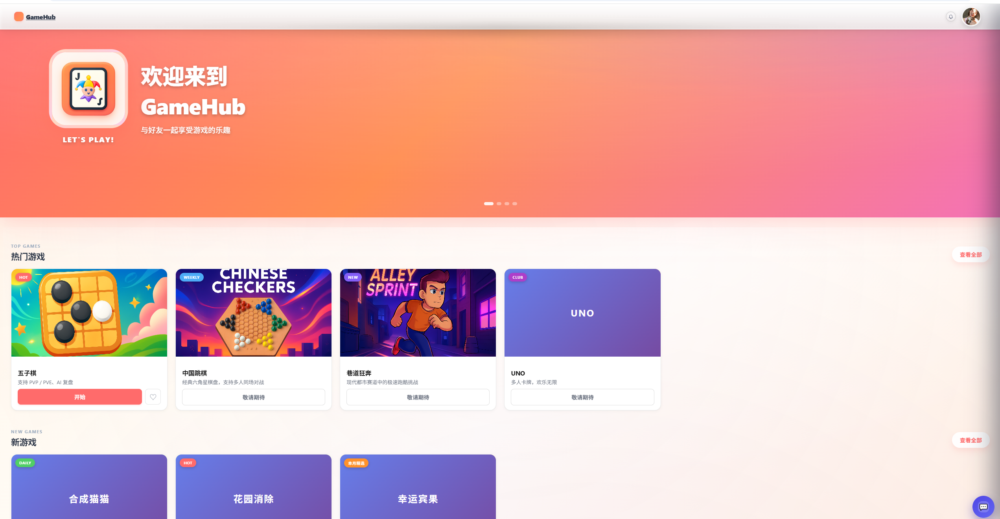
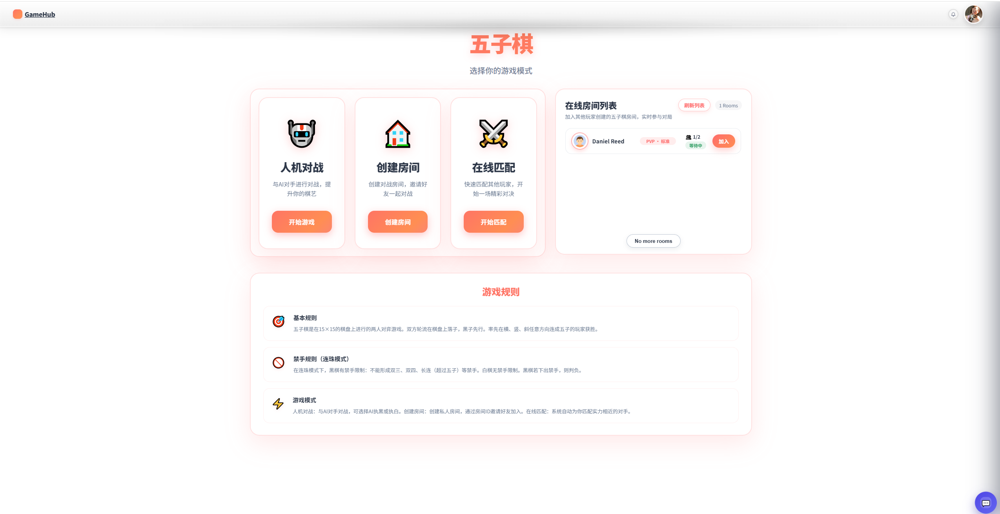
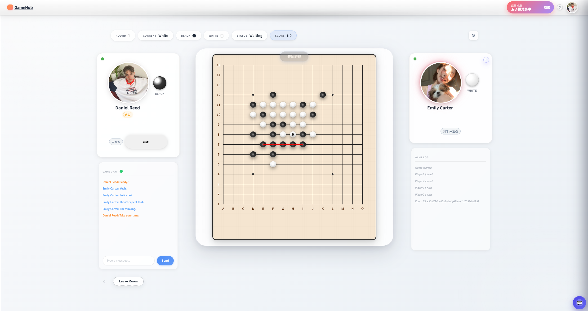
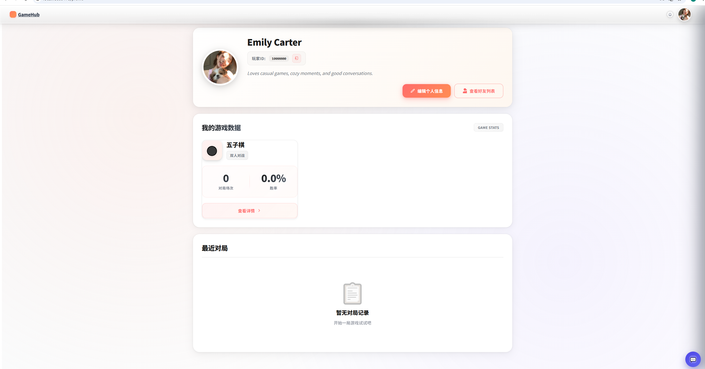
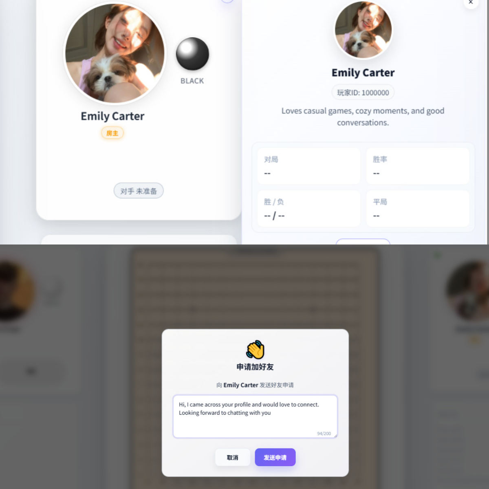
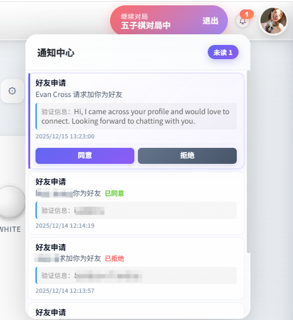
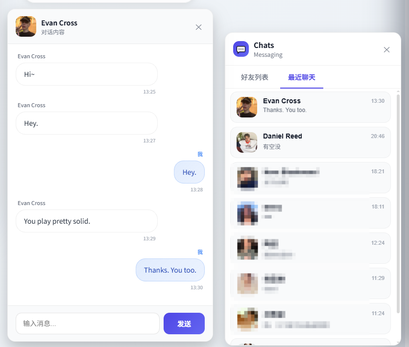

## 🎯 产品概览

Game Hub 是一个实时对战游戏平台，提供首页导航、匹配大厅、实时对战和社交聊天等核心功能。平台支持多人在线游戏，通过 WebSocket 实现低延迟的实时通信，具备完整的会话治理和状态恢复能力。

### 产品功能预览

#### 首页

*首页界面 - Hero 轮播图、游戏分类展示、进行中游戏提示*

首页提供欢迎轮播图、游戏分类展示（热门游戏、新游戏、策略/棋牌）和进行中游戏提示。用户可以通过游戏卡片快速进入匹配大厅开始游戏，或继续之前未完成的对局。

#### 匹配大厅

*匹配大厅界面 - 房间列表、快速匹配、选择模式*

匹配大厅提供房间列表、快速匹配和模式选择等功能。玩家可以创建房间、加入房间或通过匹配系统快速开始游戏。

#### 实时对战

*实时对战界面 - PVP/PVE 模式、实时棋盘同步、倒计时系统*

支持 PVP 和 PVE 模式，基于 WebSocket 实现实时棋盘状态同步，包含倒计时系统、AI 引擎和游戏状态持久化。

#### 个人中心

*个人中心界面 - 用户信息、战绩统计、设置管理*

个人中心提供用户信息管理、头像上传、战绩统计和设置功能。用户可以查看游戏数据、胜率统计、对局历史，管理个人资料和偏好设置。

#### 好友系统

*好友系统界面 - 好友列表、添加好友、好友申请管理*

提供完整的好友系统功能，支持搜索用户、发送好友申请、同意/拒绝申请、查看好友列表和好友状态。支持在线状态显示和好友分组管理。

#### 系统通知

*系统通知界面 - 实时推送、通知分类、已读未读管理*

系统通知通过 WebSocket 实时推送，包括好友申请、游戏邀请、系统公告等。支持通知分类、已读未读状态管理和批量操作。

#### 好友聊天

*好友聊天界面 - 私聊消息、消息持久化*

提供点对点私聊功能，支持实时消息收发、消息历史加载、已读未读状态显示和未读消息计数。消息持久化存储，支持跨设备同步。