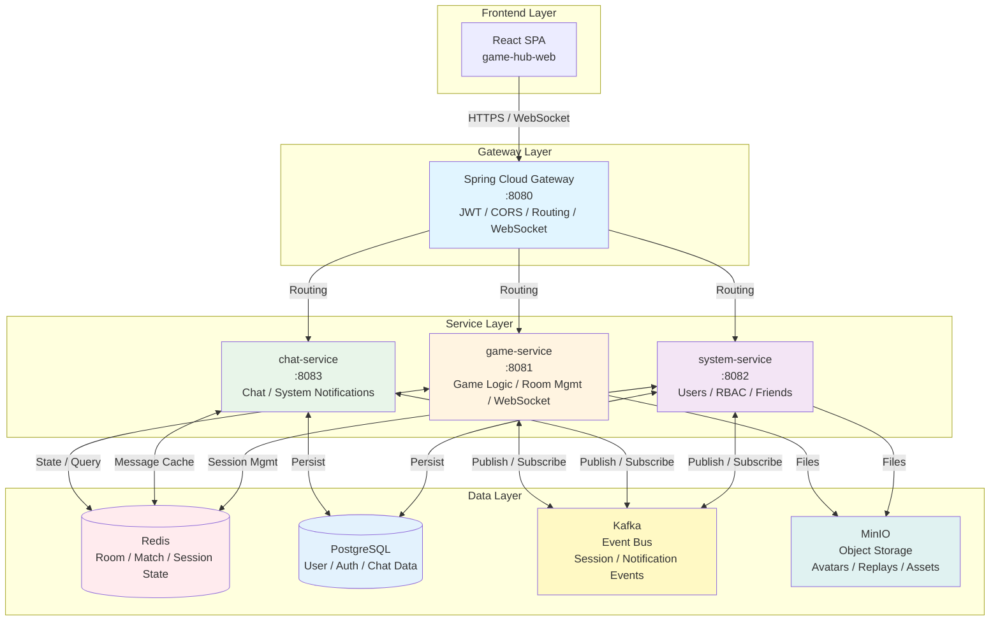

# 🎮 Game Hub - Real-Time Multiplayer Mini-Game Platform

> A production-grade Java microservices platform for real-time battles, featuring WebSocket real-time messaging, session governance, room state management, and cross-service collaboration.

[](https://www.oracle.com/java/) [](https://spring.io/projects/spring-boot) [](https://spring.io/projects/spring-cloud)

---

## Table of Contents
- [Project Intro](#project-intro)
- [Core Engineering Capabilities](#core-engineering-capabilities)
- [Product Overview](#product-overview)
- [System Architecture](#system-architecture)
- [System Capabilities](#system-capabilities)
- [Tech Stack](#tech-stack)
- [Quick Start](#quick-start)
- [Docs](#docs)

---

## Project Intro
- Real-time multiplayer platform (currently Gomoku PVP/PVE) to validate real-time communication, session consistency, concurrency isolation, and state recovery.
- Runnable microservices stack: Spring Cloud + WebSocket + Kafka + Redis + PostgreSQL + Keycloak, with focus on reliability and extensibility.

---

## Core Engineering Capabilities
- Dual-channel real-time messaging: separate WebSocket for game and chat, reducing crosstalk/backpressure.
- Session governance & single-device login: Keycloak + JWT + blacklist, multi-device kick-off and session mapping.
- Match/room re-entry & state recovery: room/match state stored in Redis; reconnect and service restart both recover.
- Room-level concurrency isolation: single execution context per room to keep ordering and avoid cross-room contention.
- Event-driven decoupling: Kafka for session/notification/room events; loosely coupled, easy to extend.
- Gomoku engine & pruning: Threat-First + α-β pruning, turn timer, illegal move checks.
- Notification system: persistent system/friend-request notifications + WebSocket push, UUID dedupe/marking.
- Gateway governance: unified routing, CORS, WebSocket tunneling, rate limiting, auth.

---

## 🎯 Product Overview

Engineering-view capability checkpoints:
- Gomoku battles: PVP/PVE, turn timer, illegal move checks.
- Room management: create/join/list; room isolation and ordered concurrency.
- Reconnect: restore match state and countdown.
- Friends & notifications: friend request/result, system push, unread management.
- Chat: lobby/room chat, persistence, read/unread.
- Profile: user info, stats, basic settings.

> Full screenshots and demo guide: [Demo & Screens](../en/demo-guide.md).

---

## 🏛️ System Architecture

*Overall microservice architecture and real-time communication diagram*

Spring Cloud Gateway as unified entry (JWT auth, routing, WebSocket forwarding). `game-service` handles rooms/matches and concurrency isolation; `chat-service` handles chat/notifications; `system-service` handles users/friends/sessions. Redis for room/match/session state; Kafka for cross-service events; PostgreSQL for persistence.



**Highlights**
- Unified gateway: auth, routing, WebSocket forwarding.
- Decoupled services: Kafka for async events, lower coupling.
- State management: Redis for room/match/session with fast recovery.
- Real-time comms: split channels for game vs chat to isolate backpressure.

### Components
| Service | Port | Responsibility |
|---------|------|----------------|
| gateway | 8080 | API gateway, JWT, routing, WS forwarding |
| game-service | 8081 | Game logic, room mgmt, real-time matches |
| system-service | 8082 | Users, RBAC, friends |
| chat-service | 8083 | Lobby/room/private chat, system notifications |

### Data Stores
- PostgreSQL: persistent data
- Redis: room/match/session state, countdown, message cache
- Kafka: cross-service event bus
- MinIO: avatars, replays, assets

---

## 🔧 System Capabilities

### WebSocket Real-Time Messaging
- Dual WebSocket channels (game/chat)
- STOMP messaging; P2P, room broadcast, system broadcast
- Gateway manages WS lifecycle and token pass-through

### Session Governance
- Single-device login; session mapping; multi-device kick-off
- Kafka-sync session state; gateway token blacklist
- Token revocation on logout

### Room/Match State & Re-Entry
- State in Redis (board, players, turn, timers); snapshot + incremental
- Client rejoin: resubscribe, receive snapshot, replay missed moves
- Server restart: restore active rooms from Redis, rebuild in-memory
- Countdown via Redis locks/expiry

### Cross-Service Collaboration
- Gateway entry; OpenFeign sync calls; Kafka async events
- Unified auth at gateway

---

## 🛠️ Tech Stack

### Backend
| Tech | Version | Notes |
|------|---------|-------|
| Java | 21 | Language |
| Spring Boot | 3.3.13 | Framework |
| Spring Cloud | 2023.0.6 | Microservices |
| Spring Security | - | Security |
| Keycloak | 25.0.1 | Identity/OIDC |
| PostgreSQL | 17.6 | Database |
| Redis | 7-alpine | Cache/State |
| Kafka | 3.7.x | Event bus |
| MinIO | RELEASE.2023-04-28T18-11-17Z | Object storage |
| Maven | - | Build |

### Frontend
| Tech | Version | Notes |
|------|---------|-------|
| React | 19.2.0 | UI |
| Vite | 7.2.4 | Build tool |
| React Router | 7.9.6 | Routing |
| SockJS | 1.6.1 | WS transport |
| STOMP.js | 7.2.1 | STOMP client |

### Infrastructure
- Docker & Docker Compose
- Spring Cloud Gateway
- OpenFeign
- Spring WebSocket

### Status
✅ Done: Gomoku (PVP/PVE); Keycloak auth; WebSocket+STOMP; friends/chat; single-device login/kick-off  
🚧 Planned: Matchmaking; stats & replay; admin UI; observability (Prom/Grafana); Kubernetes  

⚠️ **Deployment Limitation (Current Version)**  
- **Version 1.0 has known issues under multi-instance deployment and is currently recommended for single-instance deployment only.**  
- For detailed problem analysis and upgrade plans for multi-instance deployment, see:  
  - [1.0 Multi-Instance Deployment Impact Analysis](1.0-Multi-Instance-Deployment-Impact-Analysis.md)

---

## 📁 Project Structure
```
game-hub-parent/
├── apps/
│   ├── gateway/
│   │   ├── src/main/java/
│   │   └── AUTH_GUIDE.md
│   ├── game-service/
│   │   ├── src/main/java/
│   │   │   └── games/gomoku/
│   │   └── src/main/resources/
│   ├── system-service/
│   │   ├── src/main/java/
│   │   └── src/main/resources/
│   └── chat-service/
│       ├── src/main/java/
│       └── src/main/resources/
├── libs/
│   ├── session-common/
│   └── session-kafka-notifier/
├── docs/
│   ├── zh/...
│   └── en/...
├── docker-compose.yml
├── pom.xml
└── README.md
```

---

## 🚀 Quick Start

### Prerequisites
- Java 21+
- Maven 3.8+
- Docker & Docker Compose
- Git

### 1) Clone
```bash
git clone https://github.com/your-username/game-hub-parent.git
cd game-hub-parent
```

### 2) Start infrastructure
```bash
docker-compose up -d postgres redis kafka keycloak minio
```
Wait ~1–2 minutes.

### 3) Configure Keycloak
1. http://localhost:8180  
2. Admin login: `admin` / `admin`  
3. Create Realm: `gamehub`  
4. Create Client: `gamehub-client`  
5. Add users/roles  
See: [Keycloak Guide](Keycloak-Configuration-Guide.md) (Note: English version may not be available yet, see Chinese version in ../zh/)

### 4) Initialize DB (if needed)
```bash
docker exec -it pgsql psql -U postgres -d mydb
# run init SQL (see Complete-Database-Design-V1.0.md)
```

### 5) Build
```bash
mvn clean install -DskipTests
```

### 6) Run services
- Compose (recommended):
```bash
docker-compose up -d
```
- Or run locally via `mvn spring-boot:run` under each service (`gateway`, `game-service`, `system-service`, `chat-service`).

### 7) Verify
- Gateway: http://localhost:8080
- Keycloak: http://localhost:8180
- pgAdmin: http://localhost:5050
- MinIO Console: http://localhost:9001

### 8) Frontend
Frontend repo: `game-hub-web` (see its README).

---

## 🔧 Services

### Gateway (8080)
- JWT auth/refresh, routing, WS forwarding, CORS, token blacklist, kick-off
- Config: `apps/gateway/src/main/resources/application.yml`

### Game Service (8081)
- Gomoku logic (PVP/PVE), rooms, WS real-time play, timers, AI, state mgmt
- API docs: [game-service-technical-doc.md](game-service/game-service-technical-doc.md)

### System Service (8082)
- Users, RBAC, friends, notifications, avatar upload, Keycloak events
- API docs: [system-service-tech-doc.md](system-service/system-service-tech-doc.md)

### Chat Service (8083)
- Lobby chat, room chat, private chat, system notifications, Redis+PostgreSQL
- API docs: [chat-service-technical-doc.md](chat-service/chat-service-technical-doc.md)

---

## 💻 Dev Guide
- IDE: IntelliJ IDEA or Eclipse
- Plugins: Lombok, Spring Boot DevTools
- Style: Google Java Style
- Start infra: `docker-compose up -d postgres redis kafka keycloak minio`
- Run via IDE or `mvn spring-boot:run`

Code structure (DDD-inspired):
```
service/
├── domain/
├── application/
├── infrastructure/
└── interface/
    ├── http/
    └── ws/
```

Add a new game: create under `game-service/.../games/`, implement rules/AI/state; see `gomoku/` as reference (see Chinese docs for details).

Tests:
```bash
mvn test
cd apps/game-service && mvn test
```

---

## 🐳 Deployment
- Docker Compose: `docker-compose up -d`
- Logs: `docker-compose logs -f gateway` (etc.)
- Stop: `docker-compose down`
- Prod: recommend Kubernetes (planned). Reminders: change default passwords, enable HTTPS, set resource limits, health checks/restarts, add monitoring/logging.

---

## 📚 Docs
- Architecture & planning: [Project-Overall-Blueprint-and-Architecture-Hierarchy.md](Project-Overall-Blueprint-and-Architecture-Hierarchy.md)
- DB design: [Complete-Database-Design-V1.0.md](Complete-Database-Design-V1.0.md)
- Keycloak guide: [Keycloak-Configuration-Guide.md](Keycloak-Configuration-Guide.md) (Note: English version may not be available yet, see Chinese version in ../zh/)
- Service docs:  
  - [game-service-technical-doc.md](game-service/game-service-technical-doc.md)  
  - [chat-service-technical-doc.md](chat-service/chat-service-technical-doc.md)  
  - [system-service-tech-doc.md](system-service/system-service-tech-doc.md)
- Others:  
  - [Complete-Implementation-Guide-for-Single-Device-Login-System.md](Complete-Implementation-Guide-for-Single-Device-Login-System.md)  
  - [Project-Risk-List-and-Examples.md](Project-Risk-List-and-Examples.md)
- Demo & screenshots: [demo-guide.md](demo-guide.md)

---

## 📄 License
Code is for learning/review only; no commercial use, redistribution, or derivative works without explicit authorization.

---

## Copyright & Usage
Source code is for learning and review only. Commercial use, redistribution, or claiming as your own is prohibited without explicit written permission.

---

## 📞 Contact
- Email: 602979266@qq.com

---

## Copyright & Usage
For learning only; no commercial use, redistribution, or claiming as your own without permission.

---

<div align="center">

**If this project helps you, please give a ⭐ Star**

Made with ❤️ by Game Hub Team

</div>

